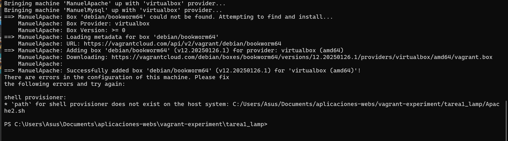
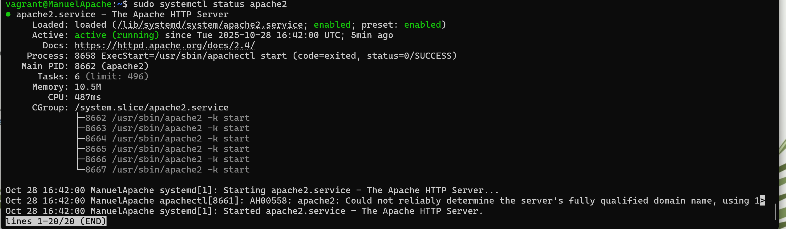
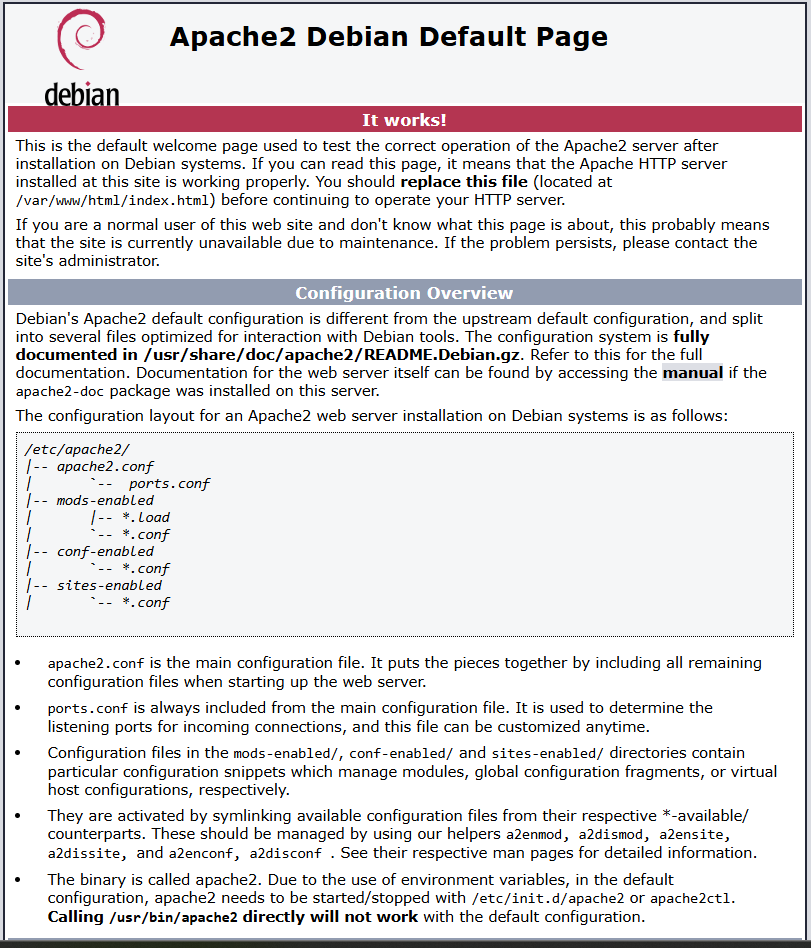
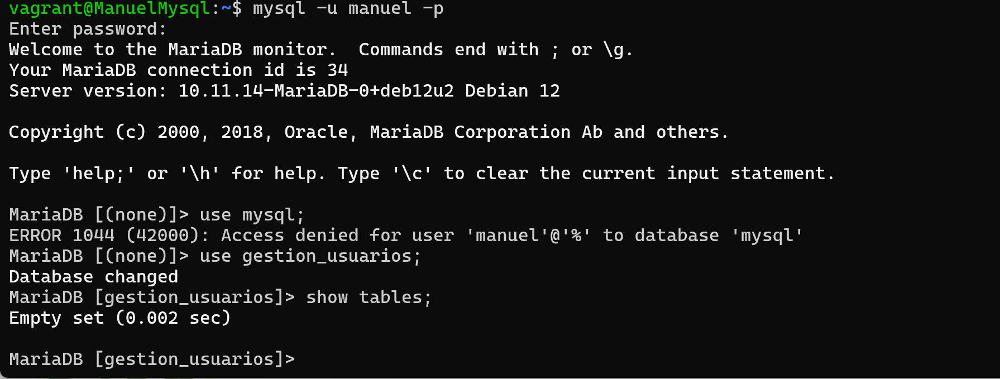
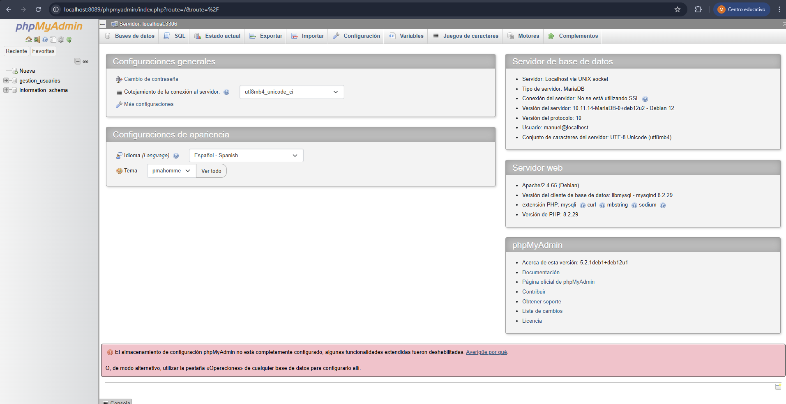
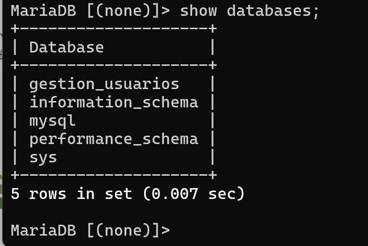

# 🖥️ Pila LAMP en Dos Niveles

🛠️ Infraestructura LAMP en Dos Niveles con Vagrant

Este proyecto implementa una infraestructura de dos niveles utilizando Vagrant y Debian 12.  
Se despliega un servidor web con Apache y un servidor de base de datos con MySQL, separados en dos máquinas virtuales.

---

## 📦 Estructura del Proyecto

```
Pila_Lamp_En_Dos_Niveles/
│
├── Vagrantfile            # Configuración de las máquinas virtuales
├── Apache2.sh             # Instalación de Apache
├── Mysql.sh               # Instalación de MySQL
├── Imagenes/              # Capturas y diagramas
│   ├── diagrama.png
│   ├── aprovisionamiento.png
│   ├── conexion.png
│   └── prueba.png
└── README.md
```

---

## 🧱 Arquitectura

**ApacheVM:** Servidor web con Apache.  
- Acceso a Internet vía NAT.  
- Reenvío de puertos: localhost:8080 → VM:80  

**MysqlVM:** Servidor de base de datos con MySQL.  
- Sin acceso a Internet.  
- Comunicación interna por red privada: 192.168.33.6  

---

## ⚙️ Vagrantfile
---
```bash
#Vamos a configurar la maquina apache.
  config.vm.define "ManuelApache" do |apache|
    apache.vm.box = "debian/bookworm64"
    apache.vm.hostname = "ManuelApache"
    apache.vm.network "forwarded_port", guest: 80, host: 8080
    apache.vm.network "private_network", ip: "192.168.33.5"
    apache.vm.provision "shell", path: "Apache2.sh"
    apache.vm.network "public_network", bridge: "enp0s3"
  end
  #Vamos a configurar la maquina mysql.
  #Importante una vez actualizados todos los repositorio y los paquetes quitarle el acceso a internet a la maquina.!!!!
  config.vm.define "ManuelMysql" do |mysql|
    mysql.vm.box = "debian/bookworm64"
    mysql.vm.hostname = "ManuelMysql"
    mysql.vm.network "private_network", ip: "192.168.33.6"
    mysql.vm.provision "shell", path: "Mysql.sh"
    #Una vez echo la creación de las maquinas quitar el public_network
    mysql.vm.network "public_network"
  end

```

---

## ⚙️ Apache2.sh
```bash
#!/bin/bash

apt update
apt install -y apache2 php 

# Con estos comando descargamos la aplicación desde el GitHub Proporcionado.
wget -O app.zip https://informatica.iesalbarregas.com/mod/url/view.php?id=4382
unzip app.zip -d /var/www/html/
chown -R www-data:www-data /var/www/html/
systemctl restart apache2
```

---



## ⚙️ Mysql.sh

```bash
#!/bin/bash

# Antes de instalar MySQL actualizamos los repositorios de la maquina y después instalaremos MariaDB.
sudo apt update
sudo apt install -y mariadb-server

# Aquí habilitaremos el servicio y lo arrancaremos "puede llamarse mysql en la mayoría de versiones"
sudo systemctl enable mariadb || systemctl enable mysql
sudo systemctl start mariadb || systemctl start mysql

# Aquí se creará la base de datos y usuario
mysql -u root <<EOF
CREATE DATABASE IF NOT EXISTS gestion_usuarios;
CREATE USER IF NOT EXISTS 'manuel'@'%' IDENTIFIED BY 'abcd';
GRANT ALL PRIVILEGES ON gestion_usuarios.* TO 'manuel'@'%';
FLUSH PRIVILEGES;
EOF
```

---


## 🖥️ Servidor Apache

El servidor web Apache se despliega en la máquina ApacheVM y sirve contenido a través del puerto 80.  
Para acceder desde el host:

- **Host (tu PC):** http://localhost:8080  
- **Máquina virtual Apache:** http://192.168.33.5:80  

---

## 🔧 Configuración de red

```ruby
apache.vm.network "forwarded_port", guest: 80, host: 8080
apache.vm.network "private_network", ip: "192.168.33.5"
```
---

Aquí se podrá observar como el servidor apache esta totalmente activo y funcionando


## 🖼️ Capturas de pantalla

🔹 **Apache funcionando**  
Acceso exitoso al servidor web desde http://localhost:8080  
  
🔹 **MySQL funcionando**  
Servicio activo y base de datos `gestion_usuarios` creada correctamente.  



  

