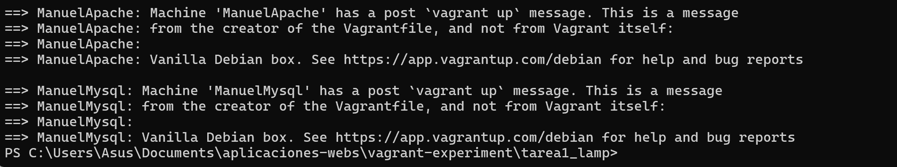

# 🖥️ Pila LAMP en Dos Niveles

🛠️ Infraestructura LAMP en Dos Niveles con Vagrant

Este proyecto implementa una infraestructura de dos niveles utilizando Vagrant y Debian 12.  
Se despliega un servidor web con Apache y un servidor de base de datos con MySQL, separados en dos máquinas virtuales.

---

## 📦 Estructura del Proyecto

```
Pila_Lamp_En_Dos_Niveles/
│
├── Vagrantfile            # Configuración de las máquinas virtuales
├── Apache2.sh             # Instalación de Apache
├── Mysql.sh               # Instalación de MySQL
├── Imagenes/              # Capturas y diagramas
│   ├── diagrama.png
│   ├── aprovisionamiento.png
│   ├── conexion.png
│   └── prueba.png
└── README.md
```

---

## 🧱 Arquitectura

**ApacheVM:** Servidor web con Apache.  
- Acceso a Internet vía NAT.  
- Reenvío de puertos: localhost:8080 → VM:80  

**MysqlVM:** Servidor de base de datos con MySQL.  
- Sin acceso a Internet.  
- Comunicación interna por red privada: 192.168.33.6  

---

## ⚙️ Vagrantfile
---
```bash
#Vamos a configurar la maquina apache.
  config.vm.define "ManuelApache" do |apache|
    apache.vm.box = "debian/bookworm64"
    apache.vm.hostname = "ManuelApache"
    apache.vm.network "forwarded_port", guest: 80, host: 8080
    apache.vm.network "private_network", ip: "192.168.33.5"
    apache.vm.provision "shell", path: "Apache2.sh"
    apache.vm.network "public_network", bridge: "enp0s3"
  end
  #Vamos a configurar la maquina mysql.

    config.vm.define "ManuelMysql" do |mysql|
    mysql.vm.box = "debian/bookworm64"
    mysql.vm.hostname = "ManuelMysql"
    mysql.vm.network "forwarded_port", guest: 3306, host: 8081
    mysql.vm.network "forwarded_port", guest: 80, host: 8082
    mysql.vm.network "private_network", ip: "192.168.33.6"
    mysql.vm.provision "shell", path: "Mysql.sh"
  end

```

---

## ⚙️ Apache2.sh
```bash
#!/bin/bash

apt update
apt install -y apache2 php 

# Con estos comando descargamos la aplicación desde el GitHub Proporcionado.
wget -O app.zip https://informatica.iesalbarregas.com/mod/url/view.php?id=4382
unzip app.zip -d /var/www/html/
chown -R www-data:www-data /var/www/html/
systemctl restart apache2
```

---


## ⚙️ Mysql.sh

```bash
#!/bin/bash

# Actualizar repositorios
sudo apt update

# Instalar Apache, PHP, MariaDB y extensiones necesarias
sudo apt install -y apache2 php libapache2-mod-php mariadb-server php-mysql php-mbstring php-zip php-gd php-json php-curl

# Habilitar y arrancar servicios
sudo systemctl enable apache2
sudo systemctl start apache2
sudo systemctl enable mariadb || sudo systemctl enable mysql
sudo systemctl start mariadb || sudo systemctl start mysql

# Crear base de datos y usuario en MariaDB
mysql -u root <<EOF
CREATE DATABASE IF NOT EXISTS gestion_usuarios;
CREATE USER IF NOT EXISTS 'manuel'@'%' IDENTIFIED BY 'abcd';
GRANT ALL PRIVILEGES ON gestion_usuarios.* TO 'manuel'@'%';
FLUSH PRIVILEGES;
EOF

# Preconfigurar phpMyAdmin para instalacion silenciosa
echo "phpmyadmin phpmyadmin/dbconfig-install boolean false" | sudo debconf-set-selections
echo "phpmyadmin phpmyadmin/reconfigure-webserver multiselect apache2" | sudo debconf-set-selections

# Instalar phpMyAdmin sin interaccion
sudo apt install -y phpmyadmin

# Habilitar extensiones PHP necesarias
sudo phpenmod mbstring
sudo systemctl restart apache2

# Configurar acceso remoto a phpMyAdmin (opcional)
sudo sed -i 's/Require local/Require all granted/' /etc/apache2/conf-available/phpmyadmin.conf
sudo systemctl restart apache2

echo " Instalacion completada. Accede a phpMyAdmin en http://localhost/phpmyadmin"
```

---



## 🖥️ Servidor Apache

El servidor web Apache se despliega en la máquina ApacheVM y sirve contenido a través del puerto 80.  
Para acceder desde el host:

- **Host (tu PC):** http://localhost:8080  
- **Máquina virtual Apache:** http://192.168.33.5:80  

---

## 🔧 Configuración de red

```ruby
apache.vm.network "forwarded_port", guest: 80, host: 8080
apache.vm.network "private_network", ip: "192.168.33.5"
```
---

Aquí se podrá observar como el servidor apache esta totalmente activo y funcionando


## 🖼️ Capturas de pantalla

🔹 **Apache funcionando**  
Acceso exitoso al servidor web desde http://localhost:8080  
  
🔹 **MySQL funcionando**  
Servicio activo y base de datos `gestion_usuarios` creada correctamente.  


  

